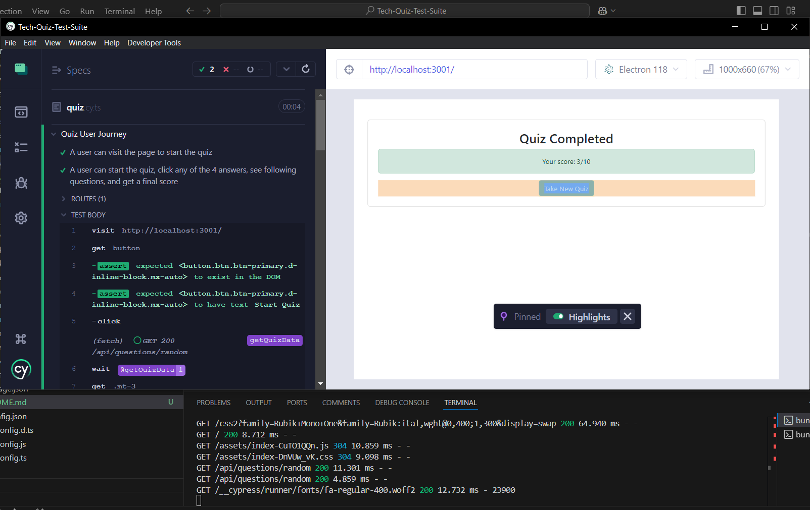

# Tech Quiz Test Suite
[](https://opensource.org/licenses/MIT)
## Description
A project that allows a user to take a programming/coding related test with 10 randomly generated questions. <br>
Main purpose was to create a component test and e2e test for the quiz application. This project will show you have to <br>
download the repo and run the tests made with Cypress.

Technologies used:<br>


## Table of Contents
- [Installation](#installation)
- [Usage](#usage)
- [Contributing](#contributing)
- [Questions](#questions)
- [License](#license)

## Installation

- The user must clone the repo locally with this command:
```bash
git clone https://github.com/PhilipMcF/Tech-Quiz-Test-Suite.git
```
- Node.JS will be needed as well as the package manager to acquire the necessary modules:<br>
https://nodejs.org/en/download/package-manager

- Npm modules are needed in order to function properly so they will need to be installed. Run this command in the root directory where the repo is installed:
```bash
npm install
```

## Usage

[Watch video demo of tests here!](https://drive.google.com/file/d/12ee297k91DJKff1k_PCnhzPjps3usPxk/view?usp=sharing)

[](https://drive.google.com/file/d/12ee297k91DJKff1k_PCnhzPjps3usPxk/view?usp=sharing)

You will need to create a .env file in the root of the local project repo. It needs a MongoDB uri and the NODE_ENV set to production. The name of the database can be changed to whatever you want instead of 'techquiz':
```bash
NODE_ENV=production
MONGODB_URI=mongodb://127.0.0.1:27017/techquiz
```
Then run this command in a terminal window from the root directory of the repo/project to start the project:
```bash
npm run start
```
Visiting http://localhost:3002 will let you start a quiz.

To run a component test, run this command in another terminal window while the project server is running:
```bash
npm run test:component
```

To run a e2e test, run this command in another terminal window while the project server is running:
```bash
npm run test:e2e
```

If you would like to run the test with the Cypress GUI, either of these commands will work:
```bash
npm run cypress
```
```bash
npm run test-gui
```

## Contributing
[](https://www.contributor-covenant.org/version/2/1/code_of_conduct/)<br>
To contribute to this project, you can fork it or create an issue and provide any suggestions or solutions.
Please try and follow the Contributor Covenant code of conduct and leave a star if you like the project.

## Questions
For any and all questions, please contact me here:
- GitHub: https://github.com/PhilipMcF
- Email: philipsm1998@gmail.com

## License
[This project is licensed under the MIT license.](#https://opensource.org/license/mit)
